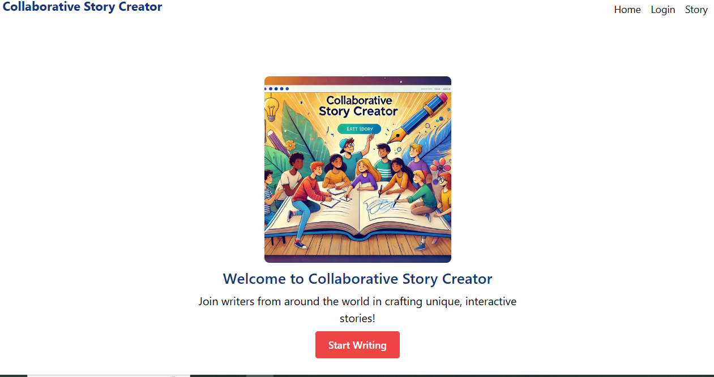
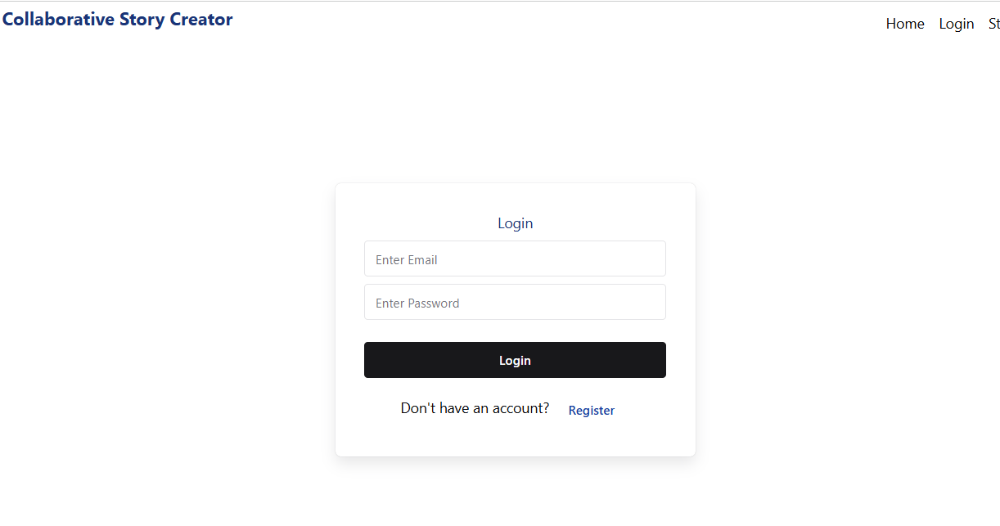
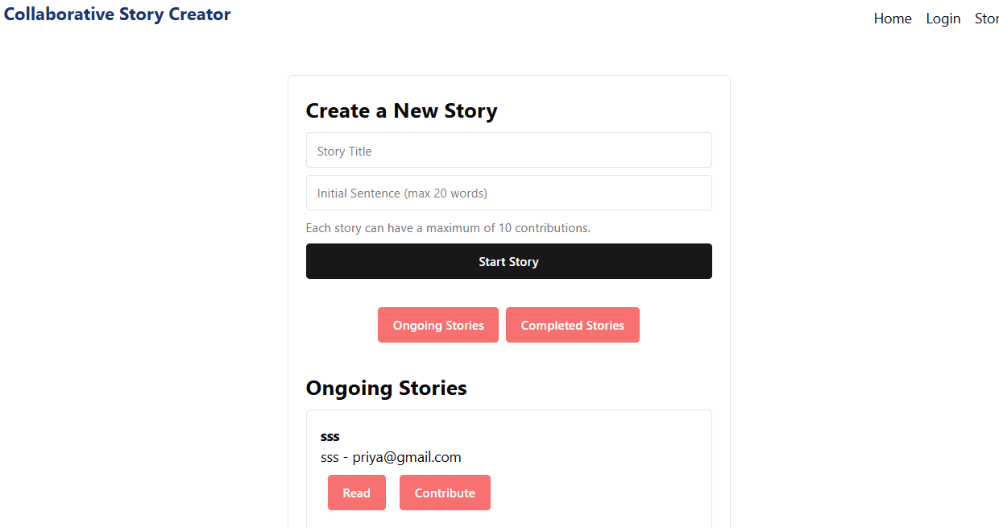

StoryCraft

 Collaborative_Story_Creator  is a collaborative storytelling web application where users can create and contribute to shared stories. Each story evolves through multiple user contributions, making it an engaging and interactive experience.

Features

📝 Create Stories: Users can start a new story with an initial sentence.

✍ Contribute: Add to existing stories with a limit of 20 words per contribution.

📜 Ongoing & Completed Stories: View and participate in active stories or read completed ones.

🔐 User Authentication: Sign up and log in to create and contribute to stories.

📱 Responsive Design: Works seamlessly across devices.

Screenshots

Home Page

Login Page

Create Story Page

Technologies Used

React.js: Frontend framework

Redux & Thunk: State management

Firebase: Authentication & database

Chakra UI: Styling

Installation & Setup

Clone the repository:

git clone https://github.com/Priya4132/Collaborative_Story_Creator.git
cd storycraft

Install dependencies:

npm install

Start the development server:

npm start

Open http://localhost:3000 in your browser.

Deployment

The application is deployed at:
👉 collaborative-story-crea-56728.web.app

Contributing

Contributions are welcome! Feel free to submit a pull request.

License

This project is licensed under the MIT License.

